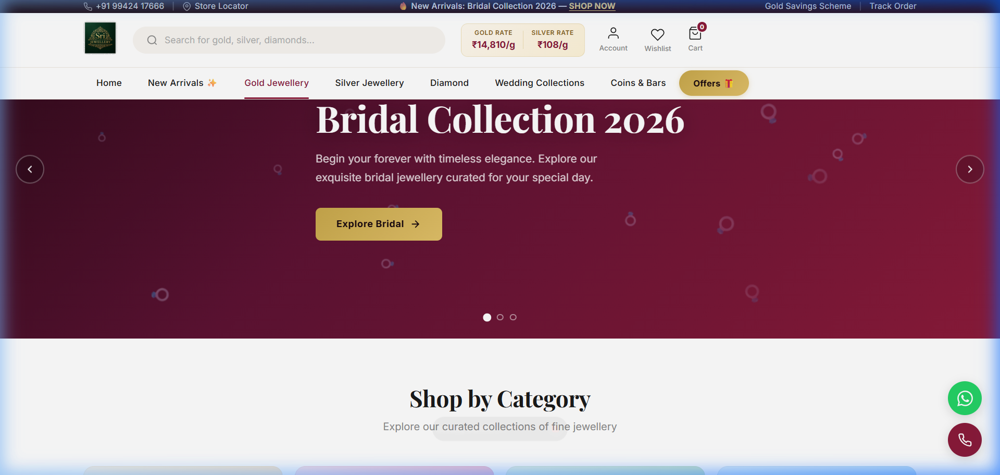

<div align="center">

# ✨ Sri Jewellery

### Premium Online Jewellery Shopping Experience

[](https://react.dev/)
[](https://www.typescriptlang.org/)
[](https://vite.dev/)
[](LICENSE)

A modern, elegant jewellery e-commerce platform built with React & TypeScript. Featuring a premium UI inspired by top Indian jewellery brands like Lalitha Jewellery and Joyalukkas.



</div>

---

## 🌟 Features

### 🏠 Homepage
- **Hero Carousel** — Auto-rotating banner showcasing Gold, Silver & Bridal collections
- **Shop by Category** — Elegant category cards with hover animations
- **Bridal Collection** — Full-width premium banner section
- **Diamond Showcase** — Curated diamond jewellery highlights
- **Newsletter Signup** — Email subscription with stylish form

### 🧭 Navigation
- **Live Gold & Silver Rates** — Real-time precious metal prices displayed in the header
- **Smart Search Bar** — Search for gold, silver, diamonds and more
- **Category Menu** — Organized navigation with New Arrivals, Gold, Silver, Diamond, Wedding & Offers
- **Top Bar** — Contact number, store locator, gold savings scheme & order tracking

### 🛍️ Collections
- **Gold Jewellery** — BIS Hallmarked 22Kt & 24Kt pieces with category filtering
- **Silver Jewellery** — Premium silver collection with search & filter
- **Product Details** — Detailed product pages with specifications, pricing & booking

### 📱 User Experience
- **Floating Action Buttons** — WhatsApp & Call buttons for instant customer support
- **Responsive Design** — Optimized for desktop, tablet & mobile screens
- **Smooth Animations** — CSS transitions, hover effects & scroll-based animations
- **Login Page** — Beautiful authentication screen with social login options

### 🎨 Design
- **Premium Color Palette** — Deep navy, maroon & gold accents
- **Elegant Typography** — Serif headings with clean sans-serif body text
- **Glassmorphism Effects** — Modern translucent UI elements
- **Micro-Animations** — Subtle hover effects and transitions throughout

---

## 🛠️ Tech Stack

| Technology | Purpose |
|:---:|:---|
| ⚛️ **React 19** | UI Components & State Management |
| 📘 **TypeScript** | Type Safety & Developer Experience |
| ⚡ **Vite 7** | Build Tool & Dev Server |
| 🧭 **React Router v7** | Client-Side Routing |
| 🎨 **Vanilla CSS** | Custom Styling & Animations |
| 📦 **ESLint** | Code Linting & Quality |

---

## 📁 Project Structure

```
Sri-Jewellery/
├── public/                  # Static assets
├── src/
│   ├── assets/              # Images & SVGs
│   ├── components/          # Reusable UI components
│   │   ├── Navigation.tsx   # Header & navigation bar
│   │   ├── Hero.tsx         # Hero carousel slider
│   │   ├── Footer.tsx       # Site footer
│   │   ├── ProductCard.tsx  # Product display card
│   │   └── Showcase.tsx     # Product showcase section
│   ├── data/
│   │   └── products.ts      # Product catalog data
│   ├── pages/
│   │   ├── Home.tsx         # Homepage
│   │   ├── GoldCollection.tsx   # Gold jewellery page
│   │   ├── SilverCollection.tsx # Silver jewellery page
│   │   ├── ProductDetails.tsx   # Product detail view
│   │   ├── Booking.tsx      # Booking / inquiry page
│   │   └── Login.tsx        # Authentication page
│   ├── App.tsx              # Root component & routing
│   ├── main.tsx             # Entry point
│   └── index.css            # Global styles & design tokens
├── index.html               # HTML template
├── vite.config.ts           # Vite configuration
├── tsconfig.json            # TypeScript configuration
└── package.json             # Dependencies & scripts
```

---

## 🚀 Getting Started

### Prerequisites

- **Node.js** — v18 or higher
- **npm** — v9 or higher

### Installation

1. **Clone the repository**
   ```bash
   git clone https://github.com/Nandhakumar456/Sri-Jewellery.git
   cd Sri-Jewellery
   ```

2. **Install dependencies**
   ```bash
   npm install
   ```

3. **Start the development server**
   ```bash
   npm run dev
   ```

4. **Open in browser**
   ```
   http://localhost:5173/
   ```

### Build for Production

```bash
npm run build
```

The production-ready files will be generated in the `dist/` directory.

### Preview Production Build

```bash
npm run preview
```

---

## 📜 Available Scripts

| Script | Description |
|:---|:---|
| `npm run dev` | Start the development server with HMR |
| `npm run build` | Build for production |
| `npm run preview` | Preview the production build locally |
| `npm run lint` | Run ESLint for code quality checks |

---

## 🤝 Contributing

Contributions are welcome! Feel free to open an issue or submit a pull request.

1. Fork the project
2. Create your feature branch (`git checkout -b feature/amazing-feature`)
3. Commit your changes (`git commit -m 'Add amazing feature'`)
4. Push to the branch (`git push origin feature/amazing-feature`)
5. Open a Pull Request

---

## 📞 Contact

**Sri Jewellery**  
📱 +91 99424 17666  
🌐 [GitHub Repository](https://github.com/Nandhakumar456/Sri-Jewellery)

---

<div align="center">

Made with ❤️ by [Nandhakumar](https://github.com/Nandhakumar456)

</div>
